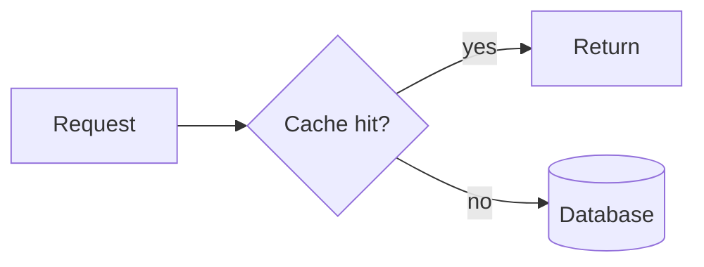

# Supplementary assets

How images, diagrams, screenshots, code, links and video work on this site, and
how to specify them during planning so drafting never stalls waiting on one.

---

## The asset slot

During `/blog-plan`, every supplementary element becomes a **slot** in
`outline.md`. A slot is a specification, not a wish. It always carries a
`source` (who produces it) and a `status`.

```markdown
> [!ASSET] diagram · required
> id: margin-allocation
> shows: two axes, blast radius vs reversibility; four quadrants labelled with
>        real engineering decisions
> format: mermaid
> alt: "Chart mapping engineering decisions by blast radius and reversibility"
> source: CLAUDE
> status: TODO
```

| Field | Meaning |
|---|---|
| `id` | Kebab-case. Becomes the filename |
| `shows` | What's actually in it. Specific enough to build from |
| `format` | `mermaid` \| `svg` \| `webp` \| `png` \| `code` \| `link` \| `video` |
| `alt` | Real alt text, written now. Not "image of diagram" |
| `source` | `CLAUDE` (I can produce it) or `IAN` (only you can) |
| `status` | `TODO` \| `HAVE` \| `DROPPED` |

**`source` is the whole point.** It splits the asset list into "things that
happen automatically" and "your homework". `/blog-plan` ends by printing the
`IAN` list, so you know exactly what to capture before drafting starts.

Things only Ian can produce: screenshots of real work, photos, video, anything
from a private repo or a running system, real numbers from real projects.

---

## Diagrams — mermaid

Preferred format. Write a fence directly in the markdown body:

````markdown

````

`src/components/Mermaid.astro` renders these client-side. Notes:

- **Lazy.** Mermaid only loads on pages that contain a fence, and code-splits
  per diagram type — a post without diagrams downloads none of it.
- **Theme-aware.** It re-renders on the light/dark toggle, so diagrams never
  end up dark-on-dark.
- **Bundled locally**, not from a CDN.
- Rendering is client-side, so a diagram is invisible to a reader with JS off
  and doesn't appear in the page source for search engines. If a diagram
  carries load the prose doesn't, restate its point in a sentence nearby.
- Keep them small. A 30-node flowchart is unreadable at 896px on a phone.

For anything mermaid can't express, hand-author an SVG into the piece's asset
directory instead.

---

## Images

```
public/assets/images/posts/<slug>/hero.webp
public/assets/images/posts/<slug>/<id>.webp
public/assets/images/projects/<slug>/hero.webp
```

- **Every piece needs its own hero.** It's the index card *and* the OG image on
  every share. The validator warns while a piece still points at the template's
  shared `post1.jpg`/`post2.jpg` stock.
- Hero aspect: roughly 16/9. The index card crops to a fixed box via
  `object-cover`, the project hero renders at `aspect-[16/9]`.
- **Prefer `.webp`.** There's no build-time image optimisation on this site —
  whatever gets committed is what ships. Compress before committing.
- Alt text is written at plan time, in the slot. Decorative images still need
  `alt=""` rather than nothing.
- In-body images use plain markdown: ``

---

## Screenshots

Always `source: IAN`. Specify in the slot what should be visible and what must
be cropped or redacted — tokens, client names, internal URLs, real customer
data. Capture at 2× and downscale; a 1× screenshot of a terminal is unreadable
on a retina display.

---

## Code blocks

Fenced with a language tag. Rendered by `@tailwindcss/typography`, which has
never been exercised on this site — **check the first one in both themes before
publishing.**

Keep samples under ~20 lines. A long listing is a link to a repo, not a code
block. If the code is from a real project, it's `source: IAN`, because I
shouldn't invent code that claims to be yours.

---

## Links and references

The `post-researcher` subagent gathers these into `research.md` during
`/blog-plan`. Rules:

- Link the primary source, not a blog post about the primary source.
- Every factual claim traceable to a link in `research.md`, or it gets flagged
  by `fact-checker` at review.
- Inline markdown links in prose. No footnote apparatus, no "further reading"
  dump at the end.
- External links open in the same tab (site-wide convention; only the project
  `Visit site` / `Source` buttons use `target="_blank"`).

---

## Video

No component for this yet. Raw HTML works in markdown, but an unstyled iframe
blows out the 896px container on mobile, and the site only went responsive
recently.

If video becomes routine, build a `<VideoEmbed>` component with a responsive
wrapper. Until then, treat video as a link, or flag it and we'll build the
component first.

---

## Where assets live before publishing

While a piece is in progress, working files sit in its workspace:

```
content-workspace/<slug>/assets/
```

`/blog-publish` moves them to `public/assets/images/posts/<slug>/` and verifies
every referenced path resolves. A broken asset path is the one error that's
invisible in a markdown diff and glaring on the live page, which is why it's a
hard failure at publish rather than a warning.
