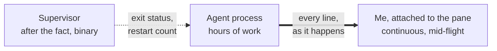
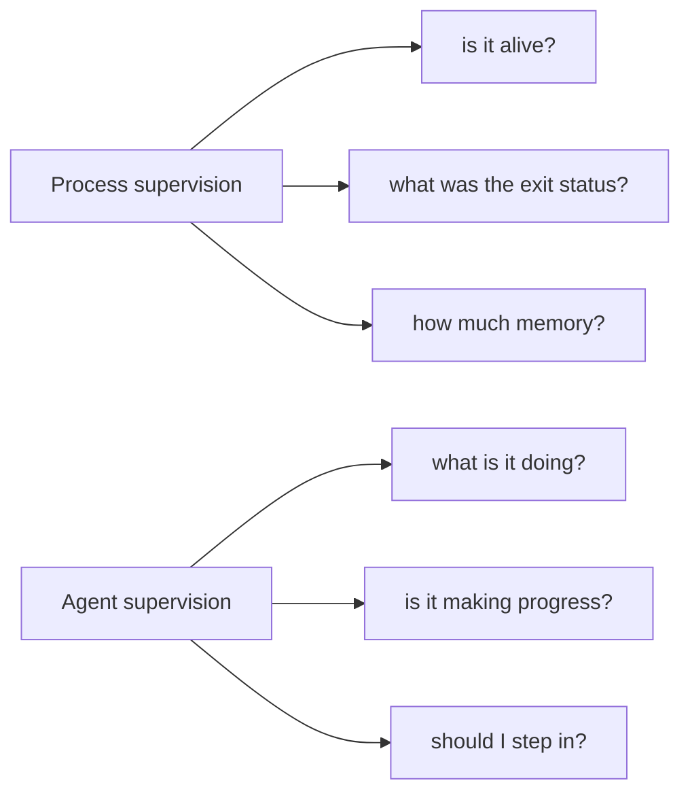

I start an agent on a remote machine, it works for hours, and I close the laptop. When I come back, either it finished or it didn't.

## An agent that runs for hours needs a home, not a request handler

That shape is not request and response. Nothing is waiting on a return value, no timeout means anything useful, and there is no response body to inspect at the end.

Treating it as a job queue item holds up for about as long as it takes to want to know how the run is going. A queue records that something was submitted and something came back. **It throws away the entire middle of the run, which is the part I actually care about.**

So the question was never how to start the process. It was what holds it while nobody is watching.

I went at that literally, and in the obvious order. First a systemd unit, because that is what you reach for when you want a process to outlive your shell. Then, when the unit gave me everything except the thing I wanted, I started writing a supervisor in Go by hand. The title of this piece is not rhetorical; I got some way into the daemon before I stopped.

## A daemon supervises a process; it doesn't let you watch one

The case for the daemon deserves full strength, because most of it is correct. `Restart=on-failure` covers a non-zero exit, a fatal signal, an operation that times out, and a watchdog that stops being fed. journald gives structured, indexed logs rather than a file I have to grep.

cgroups give real memory and CPU ceilings, enforced by the kernel instead of requested politely. Unit ordering handles dependencies, and there is no terminal anywhere in the loop. On isolation and resource control a daemon beats what I ended up with outright, and I am not going to pretend otherwise.

The argument turns on one word. A supervisor tells me a process is alive. It does not tell me it is doing the right thing.

**An agent's characteristic failure is not dying, it is continuing confidently in the wrong direction**, and that failure is invisible to a restart policy.

The process is healthy. Memory is flat. The exit code hasn't happened yet. Every signal a supervisor can read says the run is fine, while the run is not fine.

Logs don't close that gap either, because a log is a reconstruction assembled out of whatever I thought to record in advance. It answers the questions I had before the run started, which are not the questions I have during it. And even when it answers one of them well, I can't intervene in a log.

To be fair to the daemon, none of that is a hard limit of the tooling. I could have the agent report its own state through `sd_notify`, emit structured telemetry, or expose a socket that answers questions about what it is currently doing. That is the right answer eventually, and it is a better one than mine. It also means building all of it first, on top of an agent I hadn't finished, to find out whether the thing was worth finishing.

Two ways of observing the same process, and they are not the same size. One of them is a status. The other one is the work.

## Half the internet already reached for tmux, and almost nobody says why

I should be honest about how unoriginal the destination is. Putting a long-running agent in a terminal multiplexer is not an insight I had, it is what a sizeable chunk of the current tooling ecosystem is already doing.

claude-squad is the one to name directly. 8.4k stars, written in Go, tmux plus git worktrees so several coding agents can work in parallel without fighting over one checkout. Around it sits Herdr, which tracks whether the thing in a given pane is blocked or working or done, and a steady Show HN wave of agent multiplexers, switchers and status bars.

Those are utilities and products, and some of them are good ones. None of them is an argument.

**They reach for tmux without ever saying why, and not one of them treats the layer that drives tmux as something that has to be tested.** That gap is the only thing this series claims. The discovery is thoroughly covered ground.

The properties everyone is reaching for are worth stating out loud, because they are why the reach is correct. A tmux session survives a disconnect reliably, which is a thing I get rather than a thing I build. A human can attach to it at any moment from any ssh connection, with no extra tooling on the remote side and no exported port.

Panes are addressable and capturable programmatically, which is the half most people never touch. And it is already on the box, which is not nothing when the alternative comes with a deployment story.

## Inspectability is a design requirement, not a nice-to-have

The ability to watch a process work is not an operational nicety bolted on afterwards. For an autonomous process it belongs in the design, and picking a substrate that lacks it is a decision made whether or not anyone notices making it.

The practical difference is small to describe and large to live with. An exit code can tell me the job failed. A live pane can tell me the agent has been rewriting the same file for the last twenty minutes, which is not a failure any supervisor will ever report, and which I can do something about while the run is still going. **An agent I can only poll is one I hear about too late**, and the polling interval is exactly the window it had to work in unsupervised.

The first thing I published here was about [safety factors](/posts/from-buildings-to-bytes), and that is the idea that transfers. Match the rigour to the consequence, and don't spend the same margin everywhere. An autonomous process has a wide blast radius by construction, since it writes files and runs commands I did not approve one at a time. Being able to watch it is how I spend a smaller margin elsewhere without lying to myself about what that costs.

## The bill comes due on isolation

A tmux pane gives me no isolation, no resource limits and no cgroup. If the agent decides to fill the disk, nothing in my chosen substrate stands between it and the machine. A container wins this outright and it isn't close.

Which is worth saying plainly, because these don't actually compete. A container on the outside and tmux on the inside gets me kernel-enforced limits and a pane I can attach to, and that is very likely where this ends up. I didn't start there because a container wrapped around an unfinished tool is a deployment story, and I'd have spent my evenings debugging that instead of the question I was trying to answer.

Version skew is the second line on the invoice, and it is specific rather than superstitious. Control mode itself has been moving: 3.2 added pausing for slow control clients, 3.4 fixed control clients hanging on exit when pty data was still queued, and 3.5 fixed another hang after toggling no-output. Those are precisely the paths anything driving tmux as an API spends its life on.

The gaps between those releases matter as much as the changes in them. 3.2a shipped on 10 June 2021 and 3.4 shipped on 13 February 2024. That is two years and eight months during which the ground moved, and any given remote box can be sitting anywhere in that window.

Then there is Windows, which is a structural absence rather than a to-do item. Native support was [requested in October 2019](https://github.com/tmux/tmux/issues/1954) and never landed. [wmux](https://www.wmux.app/en) went the other way entirely and talks to ConPTY directly rather than accept the limitation, which is the strongest evidence available that this is a trade at all: somebody competent looked at the same wall and made the opposite call.

**None of this is a free win.** I am driving a tool built for a person at a keyboard, and control mode is a narrow door cut into the side of it for programs. I picked the door for what is on the other side, not because the door is wide.

## This was never really about tmux

Set out like that, the daemon starts to look like the wrong argument to have been having. systemd is an excellent process supervisor and I was never going to beat it at that. I had spent a week comparing tools inside a category that didn't contain the thing I needed.

Process supervision asks whether the worker is healthy. Agent supervision asks whether the work is healthy. **Almost everything I reached for answers the first question exhaustively and the second one not at all.**

tmux does not answer the second column either. What it does is refuse to throw away the evidence. A terminal agent already narrates its reasoning, its tool calls and its wrong turns into a pane, so the semantic state exists whether or not anything is designed to carry it, and a pane is a thing I can attach to.

So this is a bootstrap rather than a destination. The honest version is that I picked the cheapest substrate that preserves what I need to see, and the real answer is an agent that reports what it's doing in a form I can query, rather than one I read over the shoulder of.

## Choosing the substrate forced a library

Then I went looking for a Go library, and the substrate decision turned into a library decision.

Every Go option I found does the same thing: fork a `tmux` process per call and parse the text that comes back. Some are careless about that and some use `-F` format strings and do a reasonable job of it. None of them hold a connection open, and none of them use control mode. For something that needs live pane output rather than periodic snapshots, that is the wrong shape at the foundation.

The failures I hit were the ordinary ones, which is what makes them worth naming. Panes renumber when a neighbour closes, so an index that was right is now quietly right about something else. Session names contain spaces, because names are user input and users have a space bar. Output that has always parsed keeps parsing right up until the release where it doesn't, and it never raises an error on the way past.

So the launcher I'm building acquired a dependency it didn't ask for, which is [gotmucks](/projects/gotmucks), a Go client that speaks control mode and addresses everything by identifier. The library, predictably, was the more interesting problem, and it has got further than the thing it exists for.

That leaves one thing, and it is what part two is about. A library whose entire job is driving somebody else's process has a testing problem, and the standard Go answer to it turns out to be wrong in a way that is worth taking apart.

I didn't skip the daemon because tmux supervises better. It doesn't, and I had simply misidentified the thing that needed supervising.

The agent still runs for hours on a machine I'm not looking at. The difference is that now I can look.
