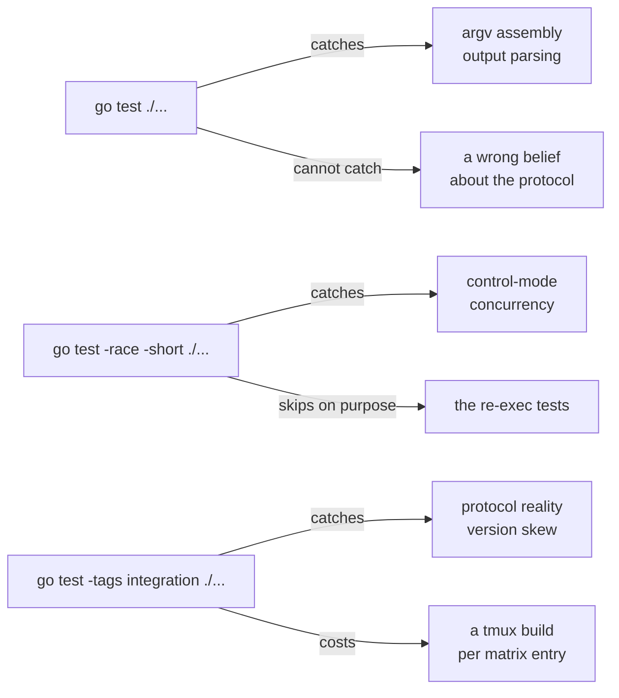

I have roughly 9,900 lines of test code standing against roughly 7,300 lines of library, and not one of them is a mock.

[Part one](/posts/i-didnt-write-a-daemon) ended with a substrate decision that had turned into a library decision, which is `gotmucks`, a Go client that drives tmux over control mode. The testing problem arrived with it.

## The standard advice stops working at the process boundary

Google's Go style guide states the orthodoxy plainly: functions "[should take interfaces as arguments but return concrete types](https://google.github.io/styleguide/go/decisions.html)". The compressed version everyone quotes, accept interfaces and return structs, is Jack Lindamood's phrasing [popularised by Dave Cheney](https://dave.cheney.net/2016/08/20/solid-go-design), and it is good advice. Define a narrow interface at the boundary, take it as a parameter, hand the test a fake.

It holds while both sides of that boundary are mine. My fake implements my interface exactly, because I wrote both of them, and a passing test is a real statement about code I control end to end.

tmux is not my code. It does not implement my interface, has never heard of my interface, and changes on a schedule I do not set. **A mock at that boundary is not a stand-in for tmux, it is a transcript of my beliefs about tmux.**

Fowler's own definition concedes the point. Mocks are "[objects pre-programmed with expectations which form a specification of the calls they are expected to receive](https://martinfowler.com/articles/mocksArentStubs.html)", and a specification I wrote about somebody else's program is a phrasebook I wrote for a language I do not speak. Rehearse both halves of the dialogue for a month and you come out fluent in your own French.

## The bug I was worried about lives in the argument vector

The risk in this library was never logic. It is whether the bytes that left the process are the bytes I meant to send.

tmux numbers every session, window and pane with an identifier that is "[unique and unchanged for the life of](https://man7.org/linux/man-pages/man1/tmux.1.html)" the thing it names, prefixed `$`, `@` and `%`. The library addresses everything that way, by `$0` and `@1` and `%2` rather than by an index that renumbers the moment somebody closes a window. That choice only pays off if the right identifier actually reaches the command line.

An interface mock records that I called my own method with the arguments I passed to it. That was never in doubt. It was true before I wrote the test, and it will still be true while the library sends a live server a session name that server quietly rewrites.

**The wire format is the thing under test, and a mock is the one component in the system that never sees it.**

It checks that I intended to ask for the bill. It cannot hear what I actually said.

## Go's own standard library doesn't mock this either

The package whose entire job is running other programs does not mock this problem away.

`os/exec` [tests itself](https://github.com/golang/go/blob/master/src/os/exec/exec_test.go) by building a fake external process and asserting on what that process was handed. The older shape of it was `exec.Command(os.Args[0], "-test.run=TestHelperProcess", "--", s...)` with a `GO_WANT_HELPER_PROCESS` marker in the environment. Current master moved to `TestMain` and a map of named fake commands. Same idea, different plumbing: the test binary re-executes itself and behaves like the program under test for the duration of one call.

That matters more than it looks. The people who wrote Go's subprocess package had every tool available to define an interface and inject a fake, and they put a real process in the room and recorded what it heard instead.

So this isn't an exotic technique invented for a tmux client. It is what the standard library does when the thing on the other side of the boundary is a process.

## A stand-in binary that records what it was handed

`gotmucks` does the same thing, and the comment at the top of `helper_test.go` says what it buys: "That is the standard os/exec testing idiom and it buys exactness: the fake records the argument vector verbatim and replies byte for byte, so argv assembly and output parsing are both pinned without a tmux installation or a build step."

The mechanism is three moves. `WithBinary(self)` points the client at the test binary, `-test.run=^TestHelperProcess$` makes the re-executed binary run exactly one function, and `GOTMUCKS_HELPER_PROCESS=1` tells that function to stop being a test and start being tmux. From there `internal/faketmux` plays a scripted reply and appends every invocation it receives to an argv log.

Here are the two halves of that, with the assertion helpers trimmed out:

```go
const helperEnv = "GOTMUCKS_HELPER_PROCESS"

// TestHelperProcess is not a test. It is the entry point the fake tmux runs
// under when the test binary re-executes itself.
func TestHelperProcess(t *testing.T) {
	if os.Getenv(helperEnv) != "1" {
		t.Skip("not the helper process")
	}
	args := os.Args
	for i, a := range args {
		if a == "--" {
			args = args[i+1:]
			break
		}
	}
	os.Exit(faketmux.Run(args, os.Stdout, os.Stderr))
}

// options point a client at the fake.
func (f *fake) options() []Option {
	f.t.Helper()

	self, err := os.Executable()
	if err != nil {
		f.t.Fatalf("locating test binary: %v", err)
	}
	return []Option{
		WithBinary(self),
		withExecPrefix("-test.run=^TestHelperProcess$", "--"),
		WithEnv(
			helperEnv+"=1",
			faketmux.EnvScript+"="+f.scriptPath,
			faketmux.EnvArgvLog+"="+f.argvPath,
		),
	}
}
```

What falls out of that log is two assertions blunt enough to be worth the whole exercise. `onlyArgv` says exactly one tmux invocation ran and here are its arguments. `wantArgv` says the nth invocation was exactly this vector, compared element by element. There is no abstraction standing between the assertion and the command line, because the command line is the artefact being asserted on.

It is hermetic and it is quick. The unit suite runs on a machine with no tmux installed and no separate build step for the fake, because the fake is the test binary. That part is worth stealing even by somebody who will never go near a multiplexer.

## A recorded reply is still a reply I wrote

The fake replies with bytes I chose.

Which means a wrong understanding of the protocol produces a fake that is wrong in exactly the same direction, and a suite that is green about it. The technique pins the argv side hard, and on the reply side it hands me back my own accent.

The sharpest version of this is sitting in my own CI config, in the comment on the notification table: "the unit suite feeds the reader lines it spells itself, so the table is only ever asserted against itself there." A notification name that a tmux release can write and the table lacks "is an event the library silently loses, and no test can catch it".

That is the characteristic failure of every golden-file suite ever written, and it is the reason the stand-in binary cannot be the whole story.

Fowler is right about the rest of it, and I am not going to pretend otherwise. End-to-end tests are "[brittle, expensive to write, and time consuming to run](https://martinfowler.com/bliki/TestPyramid.html)", and a suite shaped like a rectangle instead of a pyramid is usually one nobody enjoys owning. **The pyramid assumes the expensive tests are buying redundant confidence about your own code, and here they buy the only information available about somebody else's.** A protocol client has no cheaper way to find out that it is wrong.

## So ask the real binary what it does

The obvious answer to that is "run integration tests", and integration tests are the less interesting half of what this repo does.

The interesting half is a set of shell scripts that interrogate tmux about the claims the unit suite can only assume. `probe-notify.sh` scans the binary for its `%name` format strings, which is the complete set of notifications it could possibly write, then attaches a control client to a live server while a second client mutates sessions around it to see which ones actually come out. If either set contains a name the library's table lacks, the script exits non-zero. It is a test of the library's beliefs rather than of its behaviour.

The reason it exists is written in its own header. The rename of an unlinked window spent five review rounds in the table spelled `unlinked-window-rename`, for a notification tmux writes as `%unlinked-window-renamed`. Two more names that tmux has never emitted at all, `linked-window-add` and `linked-window-close`, were in there too. Every unit test passed for every one of those rounds, because every unit test was reading my spelling back to me.

`probe-roundtrip.sh` asks the same kind of question about escaping. It sends values through a real server and reads them back, and fails if this release escapes a byte the decoder does not undo, or stops expanding one of the five arguments the package doubles the `#` in.

Ten further probe scripts run in a single step on every integration job, and none of them can fail it. That is deliberate: "Not assertions: these print how this release actually behaves, so that a matrix failure comes with the evidence next to it." Diagnostics as a first-class CI output, sitting in the log before the failure rather than reconstructed after it.

The general principle is the one I would take away from this if I read it somewhere else. When your suite can only assert your own spelling back at itself, stop rereading the phrasebook and go and ask somebody who speaks the language.

## A matrix only helps if it actually runs

CI builds tmux 3.2a, 3.4 and 3.5a from source and runs the integration suite against each, on private sockets named with the process id so a test run can never touch a developer's own sessions. The versions are not superstition. 3.4 fixed control-mode clients hanging on exit with pty data still queued, and 3.5 fixed another hang on exit after toggling no-output.

The most expensive thing I learned here had nothing to do with the technique. Those two assertion probes originally ran before the integration suite, and they abort at the first failed claim, and a failing step ends the job. So on 3.4 and 3.5a the suite had never run at all, and what the package did on those releases "was unknown rather than bad". The fix was reordering. The assertions still fail the job, they just no longer decide whether anything is learned from the run.

**A test you never reach is indistinguishable from a test that passes.**

The stand-in binary has a bill of its own, and it is paid to the race detector. Every use of the fake re-executes the test binary, and under `-race` that binary is instrumented, so every launch pays instrumented startup. Hence two steps rather than one raced sweep: the sweep "took 150s where these two take about 19s together". The reasoning matters more than the clock. `-short` keeps every control-mode test, because those run over in-memory pipes and start no process, and skips argv assembly and output parsing, which is one goroutine calling a subprocess with no race in it to find.

Fuzzing runs on top of that, 60 seconds per target on every push, against the output escaping round trip, because that is the code handling text I did not write. The same config fails the build if `go.sum` is non-empty, which is a test of a design decision rather than of any behaviour.

Three commands, three classes of failure, each one blind to something the others catch.



I went looking for somewhere to put an agent, and I found it. The rent is a test matrix.
